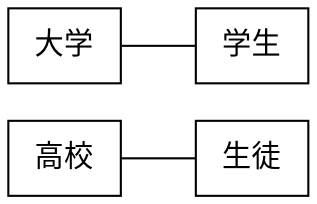
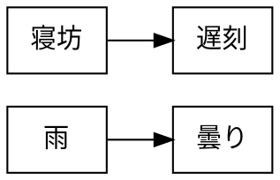
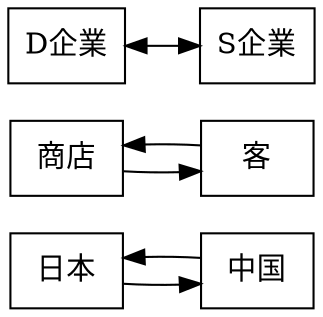
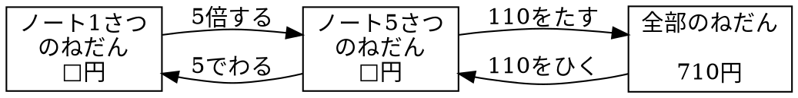

# 記述例

## Graphviz

### 図 3.1 無向グラフ



### 図 3.2 有向グラフ(単方向)



### 図 3.3 有向グラフ(双方向)



### 図 3.4 関係図



### 図 3.5 WBS

```plantUML
@startwbs uml01
* UML 2.0 
** 構造に関する表記
*** クラス図
*** オブジェクト図
*** パッケージ図

@endwbs
```
